# Agentic Personalized Learning Coach

This is a personal AI-powered study planner app built with Streamlit and LangChain (Ollama local models).  
It is designed as a **agentic personalized learning coach** that can break down topics, generate custom study plans, track user progress, and support multiple user profiles with local data persistence.

---

## ✨ Features

🪄 Break down any learning goal into detailed subtopics  
🪄 Generate a personalized multi-week study plan  
🪄 Adjust plan dynamically based on progress notes  
🪄 Save, load, reset plans and progress notes  
🪄 Download subtopics and study plan as `.md` files  
🪄 Multi-user support (each user has separate saved plans and progress)  
🪄 Dark mode styled UI with custom CSS

---

## ✨ Folder Structure

```
.
├── app.py                # Streamlit frontend app
├── agent_logic.py        # Core agent prompts and LLM calls
├── plan_generator.py     # Plan storage and download helpers
├── progress_tracker.py   # Progress notes storage
├── config.py             # Ollama model config
└── data/
    └── users/
        └── {username}/
            ├── plan.json
            └── progress_log.json
```

---

## ✨ Tech Stack

- [Python 3.10+](https://www.python.org/)
- [Streamlit](https://streamlit.io/) (UI)
- [LangChain](https://python.langchain.com/) (Agent logic)
- [Ollama](https://ollama.com/) (Local LLaMA3.2 model)

---

## ✨ Screenshots

#### [1] - User Profile (Before Setting Username)
App requires user to set their username in the sidebar before use.
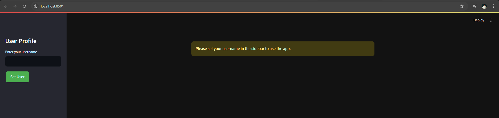

---

#### [2] - User Profile (After Setting Username)
Confirmation message after entering username.
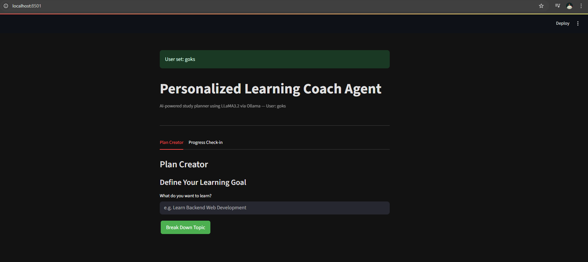

---

#### [3] - Plan Creator Overview
Full view of the Plan Creator tab with all main controls.
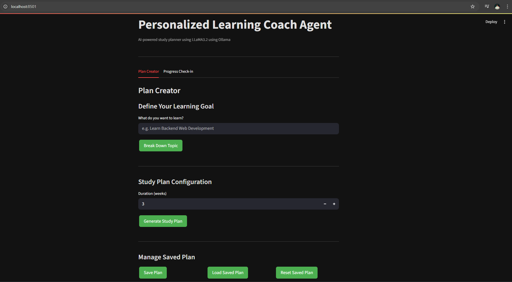

---

#### [4] - Break Down Topic
User inputs their learning goal and triggers subtopic generation.
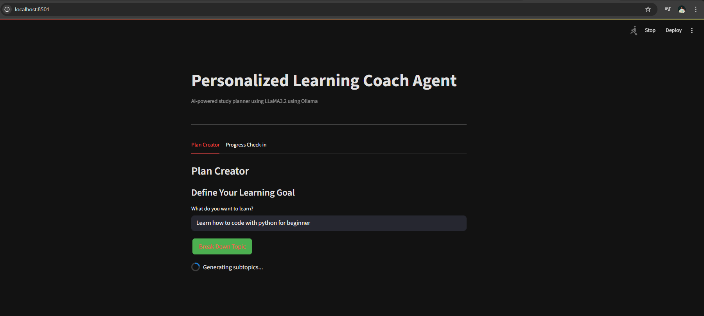

---

#### [5] - Result: Generated Subtopics
AI-generated subtopics displayed with expand/collapse.
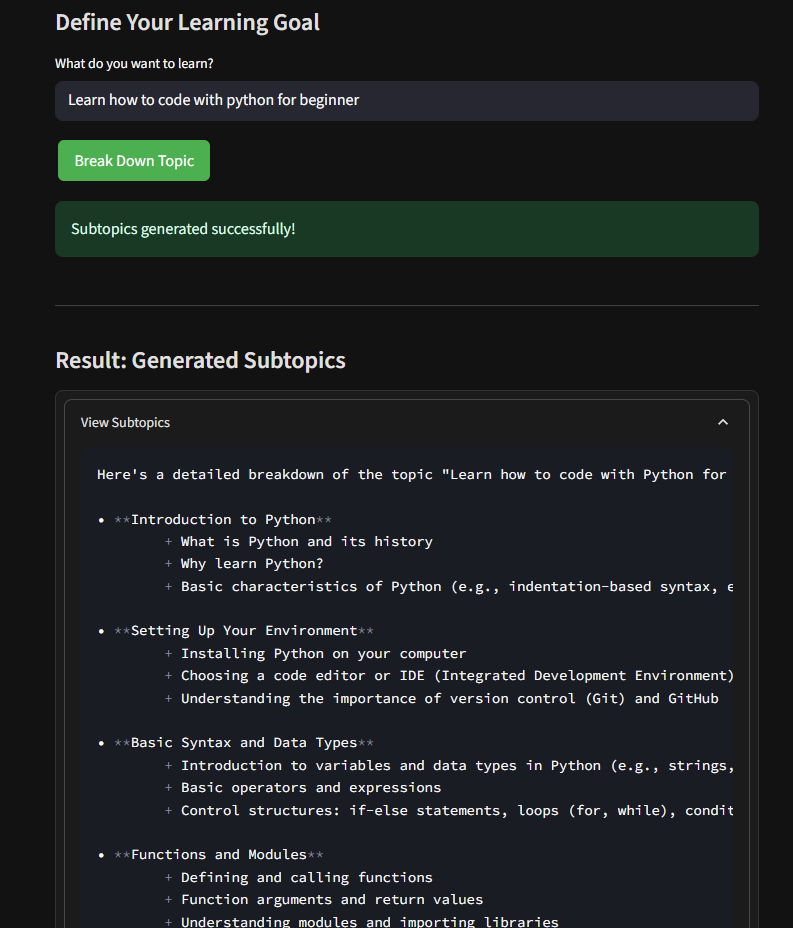

---

#### [6] - Download Subtopics and Study Plan Config
Option to download subtopics (.md) and configure study plan duration.
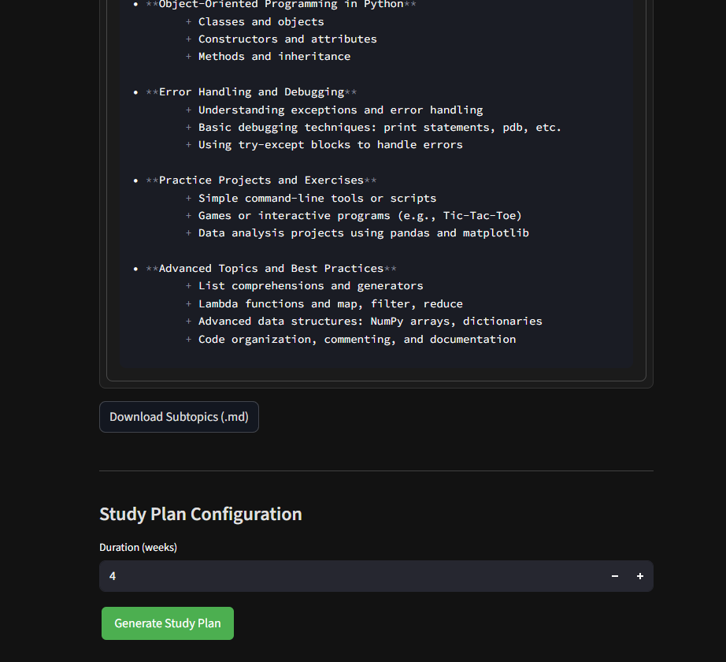

---

#### [7] - Example of Downloaded Subtopics.md
Preview of the downloaded markdown file with structured subtopics.
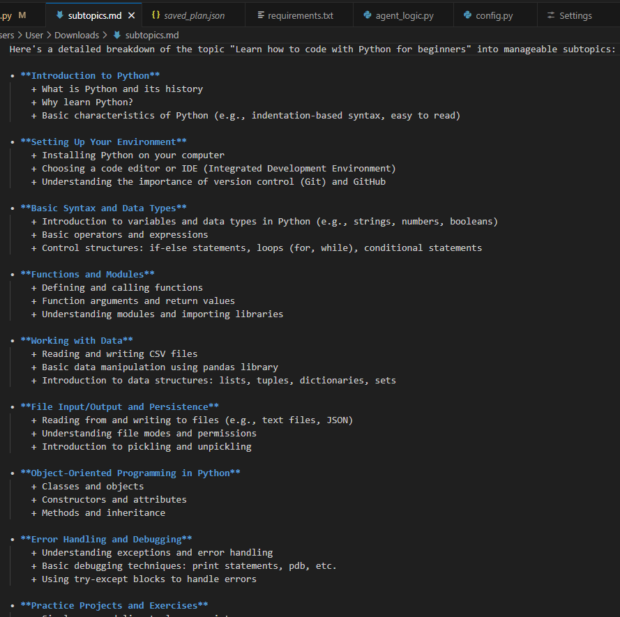

---

#### [8] - Generate Study Plan
User sets preferred duration and generates a personalized study plan.


---

#### [9] - Result: Study Plan Generated
Detailed, multi-week plan displayed in an expander.
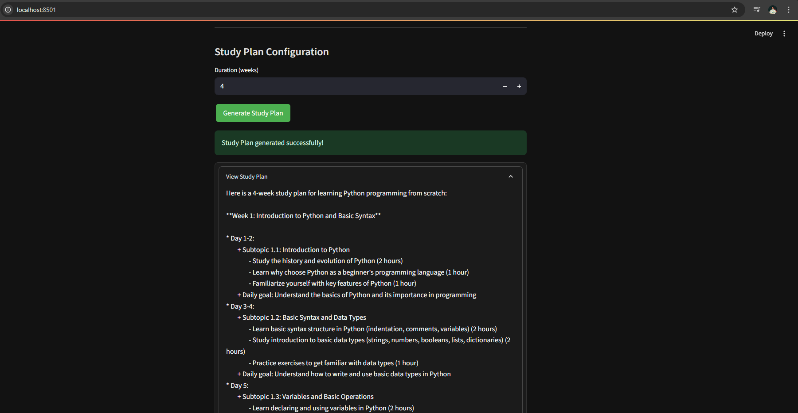

---

#### [10] - Download and Manage Plan
Options to download plan (.md) and manage save/load/reset.
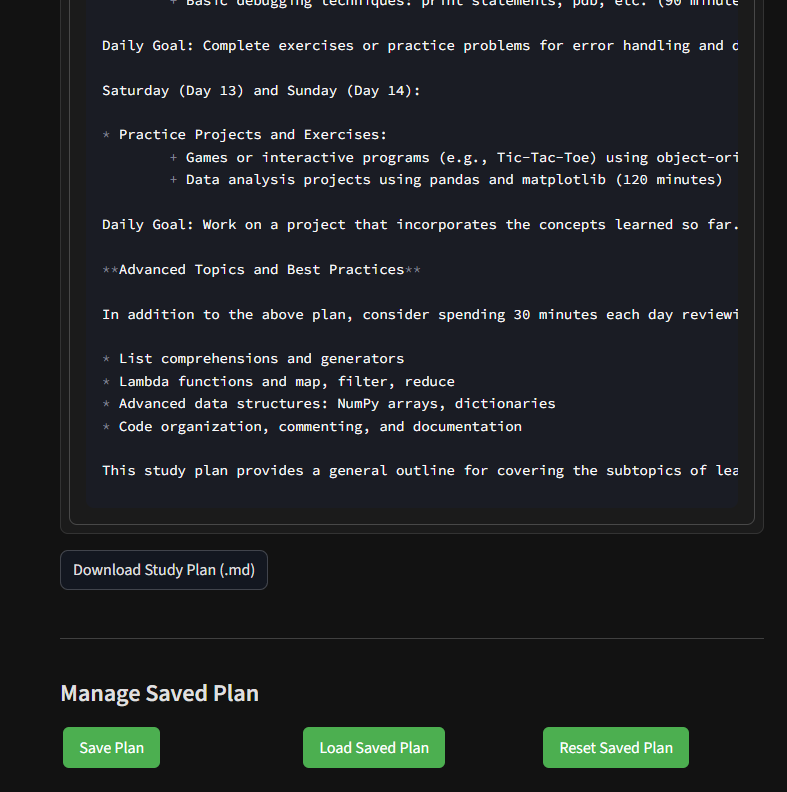

#### [11] - Save Plan JSON File
Shows plan saved locally for the current user.  
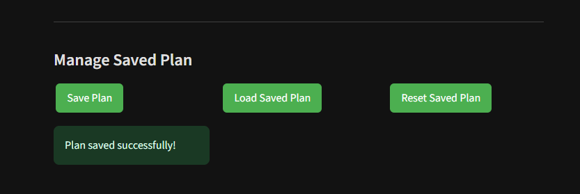

---

#### [12] - Load Saved Plan
Loads the previously saved study plan.  
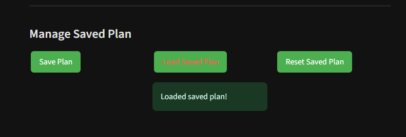

---

#### [13] - Reset Saved Plan
Deletes saved plan for the current user.  
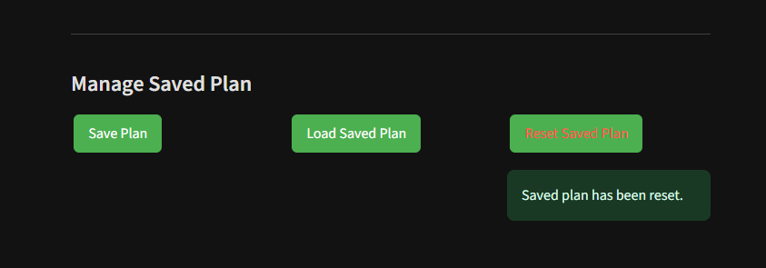

---

#### [14] - Saved Plan and Progress Folder Structure per User
Example local data folder showing separate plans and progress logs for multiple users.  
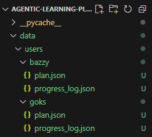

---

#### [15] - Study Plan Auto Appears in Progress Tab
Plan automatically prefilled in Progress Check-in.  
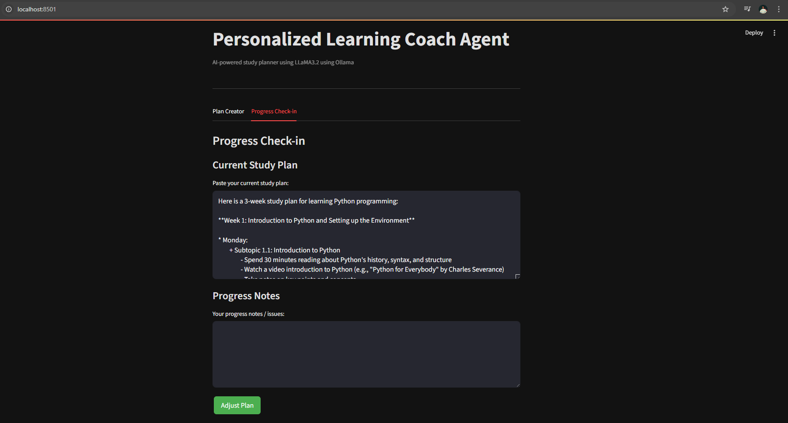

---

#### [16] - Adjust Plan in Progress Tab
User provides progress notes to adjust plan.  
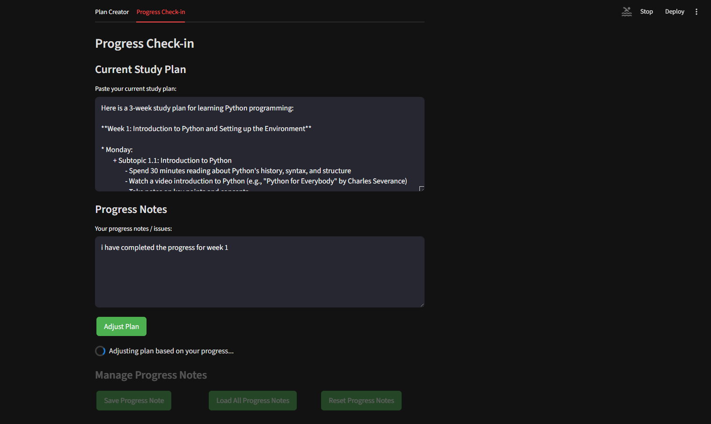

---

#### [17] - Result: Adjusted Plan
AI generates new plan based on user progress.  
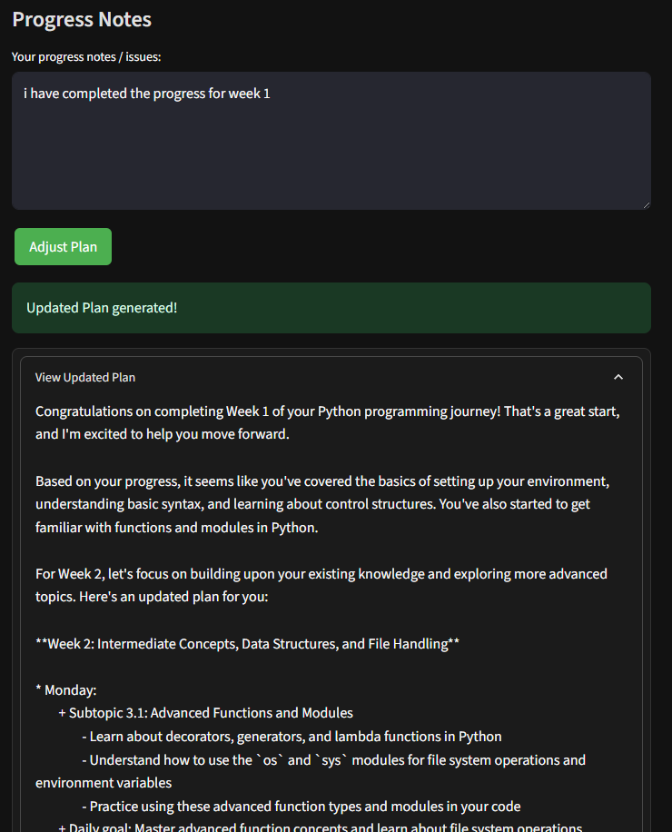

---

#### [18] - Load Progress Notes
Loads previously saved progress notes.  
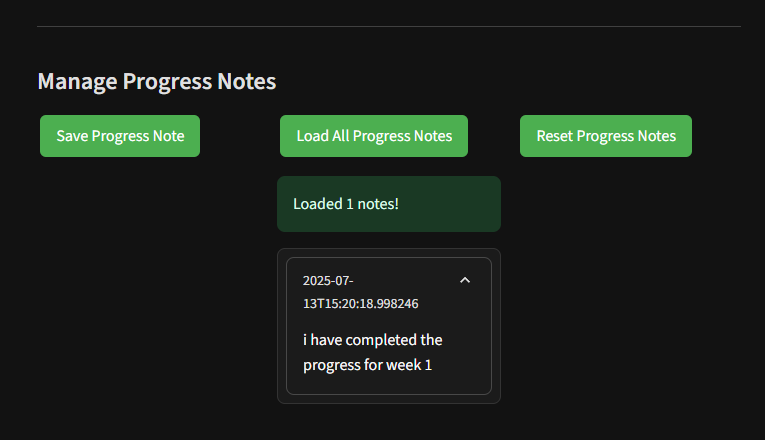

---

#### [19] - Save Progress Notes
User can save current progress notes.  
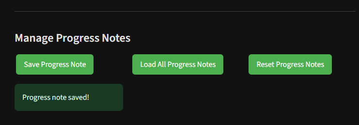

---

#### [20] - Reset Progress Notes
Deletes all saved progress notes.  


---

## ✨ Requirements

- Python 3.10+
- Local Ollama server running with pulled model (e.g. `llama3.2`)

Example Ollama setup:
```
ollama serve
ollama pull llama3.2
```

---

## ✨ Installation & Run

[1] Clone this repository
```bash
git clone https://github.com/nafhansyandana/agentic-learning-plans.git
cd personalized-learning-coach
```

[2] Install dependencies
```bash
pip install -r requirements.txt
```

[3] Make sure Ollama server is running
```bash
ollama serve
```

[4] Run the app
```bash
streamlit run app.py
```

---

## ✨ Usage Guide

- **Set Username**: Choose/insert your user profile in the sidebar  
- **Plan Creator Tab**:
  - Enter learning goal
  - Break down into subtopics
  - Generate study plan for N weeks
  - Download plan/subtopics
  - Save/load/reset your plan
- **Progress Check-in Tab**:
  - Paste current plan
  - Add progress notes
  - Adjust plan with AI
  - Save/load/reset your progress notes

All plans and progress notes are saved **per user** in local storage.

---

## ✨ Data Storage

- All user data is stored in:
```
/data/users/{username}/
```
- plan.json
- progress_log.json

This ensures user separation and multi-user capability even in local deployments.

---

## ✨ Contributing

PRs are welcome! Feel free to open issues or suggest new features.

---

## ✨ License

MIT License

---

## ✨ Acknowledgements

- [Streamlit](https://streamlit.io/)
- [LangChain](https://langchain.com/)
- [Ollama](https://ollama.com/)

---

*This Project is Built as a personal portfolio / learning project.*
